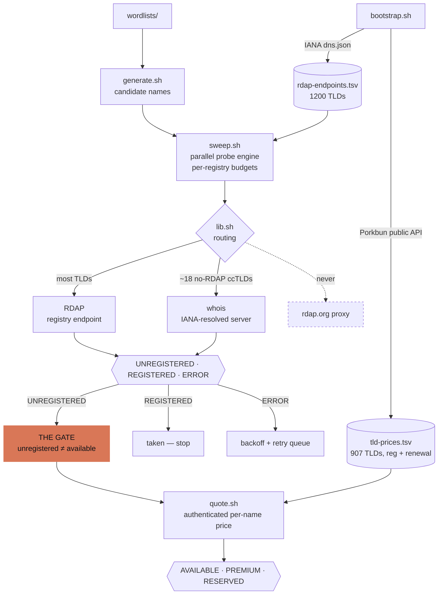

# DomainSaver

Large-scale domain availability and price lookups in portable bash — that refuse to
call a name "available" without a real price quote.


*Regenerate with `vhs demo/demo.tape`. The tape gives Codex short
`$domain-search` check and quote requests; nothing in it is staged — those are
live registry and registrar responses.*

*Created by [Jon Hammant](https://github.com/jhammant/DomainSaver) with Claude; the same skill now works with both Claude Code and Codex.*

## Why this exists

**Availability is not purchasability.**

Every naive domain tool works the same way: ask the registry, and if it answers "not
found", report the name as available. That answer is wrong roughly as often as it is
right, because an RDAP 404 means only *"not present in the registry"* — which covers
three completely different commercial realities:

- genuinely available at the TLD's list price,
- **registry-reserved** — the registry will never sell it to you, at any price,
- **premium-priced** — for sale, routinely at 10x to 200x the list price.

These are measured results from this project, verified against live registrar quotes:

| Name           | Registry said   | Actually quoted | TLD list price |
| -------------- | --------------- | --------------- | -------------- |
| `shed.link`    | not registered  | **$819.27/yr**  | $7.72          |
| `bar.link`     | not registered  | **$1638.01/yr** | $7.72          |
| `allotment.co` | not registered  | **$109.47/yr**  | $15.76         |
| `shed.page`    | not registered  | **$64.93/yr**   | $10.81         |
| `shed.top`     | not registered  | **$50.91/yr**   | $4.63          |

And the reservation case, which no amount of probing can detect: **633 of the 676
two-letter `.foo` domains show as unregistered.** None of them are for sale — Google
Registry reserves them. The control group is `.uk`: **all 676 two-letter `.uk` names
are registered**, precisely *because* Nominet has no premium tier, so investors swept
them at list price years ago.

That inverts the intuition most people bring to this. **High apparent availability at
short lengths is not opportunity — it is a premium-pricing signal.**

So DomainSaver keeps five states apart and never collapses them:

| Status         | Meaning                                                             |
| -------------- | ------------------------------------------------------------------- |
| `REGISTERED`   | Taken.                                                              |
| `UNREGISTERED` | Absent from the registry. May be available, reserved, *or* premium. |
| `AVAILABLE`    | Unregistered **and** a real quote confirms standard-ish pricing.    |
| `PREMIUM`      | Unregistered, quoted, purchasable — far above the TLD's list price. |
| `RESERVED`     | Unregistered but the registrar returns no sellable offer.           |

Only `quote.sh` — the one script that makes an authenticated, per-name pricing call —
is allowed to print `AVAILABLE`, `PREMIUM` or `RESERVED`. Everything else stops at
`UNREGISTERED` and says so loudly. (`quote.sh` has two more: `UNAVAILABLE`, when a name
is not sellable and there is no probe evidence to say why, and `ERROR`, which is never
an answer — re-run it.)

## How it works

The pipeline exists to defend one boundary: **a probe can never promote a name to
`AVAILABLE`.** Registry lookups are cheap and unauthenticated, so they run wide; the
authenticated per-name quote is expensive and rate-limited, so it runs only on the
survivors. That split is what makes a 900-TLD sweep affordable *and* honest.



Without a Porkbun key the pipeline still runs end to end — it just stops at the gate
and reports `UNREGISTERED`, which is the honest answer rather than a guess.

## Requirements

- **bash 3.2+** (the `/bin/bash` macOS ships). No node, no python, no build step.
- `curl`, `jq`, `awk`, `whois`, plus the POSIX basics (`sort`, `xargs`, `tr`, `sed`,
  `grep`, `mktemp`).

Everything is written for BSD *and* GNU userland: no `sed -i`, no GNU-only flags, no
associative arrays.

```bash
# macOS
brew install jq whois

# Debian / Ubuntu
sudo apt-get install -y curl jq whois
```

`jq` is required by `bootstrap.sh`, `quote.sh` and `check.sh --json`. `whois` is
required for the ~18 TLDs with no RDAP service at all — `.io`, `.co`, `.me`, `.de`,
`.ch` and friends. Everything else, `.uk` and the Identity Digital TLDs included, goes
over RDAP. Note that `dig` is **not** used — see [Limitations](#limitations).

## Install

```bash
git clone https://github.com/stephenlclarke/DomainSaver.git
cd DomainSaver
./scripts/bootstrap.sh
```

`bootstrap.sh` downloads and verifies the two public, unauthenticated data sources the
toolkit runs on, into `data/`:

```text
[ds] [1/7] IANA RDAP bootstrap (https://data.iana.org/rdap/dns.json)
[ds] [2/7] building data/rdap-endpoints.tsv (tld -> rdap base url)
[ds]       1200 TLDs mapped
[ds] [3/7] Porkbun public pricing (https://api.porkbun.com/api/json/v3/pricing/get)
[ds] [4/7] building data/tld-prices.tsv (tld -> registration/renewal/transfer)
[ds]       907 TLDs priced
...
[ds] verifying...
[ds] data/ is ready
```

`bootstrap.sh` never installs a download that fails its shape check, so a captive
portal or a truncated transfer can't quietly poison your results. Re-run it weekly (or
`--force`); `--rebuild` works entirely offline from the cached JSON.

No credentials are needed to install, and none are needed for anything except per-name
premium quotes.

| File in `data/`        | What it is                                              | Regenerated by `bootstrap.sh`? |
| ---------------------- | ------------------------------------------------------- | ------------------------------ |
| `rdap-endpoints.tsv`   | TLD → RDAP base URL, from the IANA bootstrap (1200 rows) | Yes — delete it freely         |
| `tld-prices.tsv`       | TLD → registration / renewal / transfer (907 rows)       | Yes — delete it freely         |
| `whois-servers.tsv`    | TLD → whois server; seeded, then grown lazily            | Seeded; your rows are kept     |
| `tld-flags.tsv`        | Extra reputation flags — **edit this**                   | Seeded; your rows are kept     |
| `rdap-overrides.tsv`   | Force an endpoint, or force whois — **edit this**        | Written once, never rewritten  |
| `registry-limits.tsv`  | Per-registry concurrency budgets — **edit this**         | No, hand-maintained seed data  |

### Run DomainSaver with Claude Code or Codex

The scripts answer *"is this name free, and what does it cost?"*. They cannot answer *"I need a domain, I don't know what for yet."* — inventing candidates with meaning, and reading what a sweep implies, are model work.

`SKILL.md` packages that half as an open Agent Skill understood by both [Claude Code](https://code.claude.com/docs/en/skills) and [Codex](https://developers.openai.com/codex/skills/). It runs the search as a funnel: propose naming *directions*, generate hundreds of candidates inside whichever the user likes, sweep them safely, cost them on renewal price, and quote only the finalists.

DomainSaver does not need or store an Anthropic or OpenAI API key. Porkbun credentials are separate: they are needed only when the skill quotes finalists to distinguish `AVAILABLE`, `PREMIUM` and `RESERVED` names. See [Porkbun API key](#porkbun-api-key-optional-strongly-recommended) for the two environment variables, and never paste either secret into an agent prompt.

#### Install the skill

Run the installer from the DomainSaver checkout:

```bash
./install.sh                            # install for Claude Code (the default)
./install.sh --target codex             # install for Codex
./install.sh --target both              # install for Claude Code and Codex
./install.sh --dry-run --target both    # preview either installation mode
```

| Host | Installer selection | Default skill directory | Explicit invocation |
|---|---|---|---|
| Claude Code | default or `--target claude` | `${CLAUDE_CONFIG_DIR:-$HOME/.claude}/skills/domain-search` | `/domain-search` |
| Codex | `--target codex` | `$HOME/.agents/skills/domain-search` | `$domain-search` |

When `CODEX_HOME` is explicitly set, the Codex target uses `$CODEX_HOME/skills/domain-search`. DomainSaver 1.1 and earlier installed Codex skills under `$HOME/.codex/skills`; the installer detects an existing installation there and keeps updating it rather than creating a duplicate. To move one to the current location, uninstall and reinstall it explicitly:

```bash
./install.sh --uninstall --target codex
./install.sh --target codex
```

Symlink mode is the default, so `--target both` gives both hosts the same skill files and caches. Use `--copy` if the checkout may move; with `--target both`, copy mode creates two independent snapshots. Use `--force` to replace an existing installation. `--prefix DIR` remains available for one target at a time.

Uninstall with the same target used to install. With no target, uninstall also defaults to Claude Code:

```bash
./install.sh --uninstall                 # Claude Code
./install.sh --uninstall --target codex  # Codex
./install.sh --uninstall --target both   # both hosts
```

#### Claude Code

Start or restart Claude Code after installation, then invoke the skill directly or let Claude select it from a matching request:

```text
/domain-search Find and rank short, trustworthy domains for a UK developer tool.
```

The same skill can activate automatically when a request matches its description.

#### Codex app

1. Open the Codex app and sign in with your ChatGPT account.
2. Open the folder you want to use as the workspace. The skill may create files
   such as `candidates.txt`, `swept.tsv` and `priced.tsv` there.
3. Start a new task and invoke the skill explicitly:

   ```text
   $domain-search Find and rank short, trustworthy domains for a UK developer
   tool. Prefer .com, .dev and .io, avoid hyphens, and optimise for renewal cost.
   ```

Codex can also select the skill automatically from a plain-language domain
search request. Naming `$domain-search` explicitly makes the intended workflow
unambiguous.

#### Codex CLI

Install the current Codex CLI by following the
[official CLI guide](https://developers.openai.com/codex/cli/), then authenticate
with your ChatGPT account:

```bash
codex login
codex login status
```

For an interactive session, launch Codex in a workspace where it may write the
search results:

```bash
cd /path/to/workspace
codex
```

At the Codex prompt, run `/skills` to confirm that `domain-search` is available,
then invoke it:

```text
/skills
$domain-search Check shed.link, find ten lower-cost alternatives, and rank them.
```

You can also supply the request when starting an interactive task:

```bash
codex -C /path/to/workspace \
  '$domain-search Find memorable .dev domains for a deployment dashboard.'
```

For a scriptable, non-interactive run, use `codex exec`. Domain searches need
outbound network access, and `workspace-write` lets the skill create its working
and result files inside the selected workspace:

```bash
codex exec --sandbox workspace-write -C /path/to/workspace \
  '$domain-search Find and rank short domains for an incident review tool.'
```

Keep the prompt in single quotes in shell commands so the shell passes the
literal `$domain-search` name to Codex instead of expanding it as an environment
variable. Codex may ask you to allow the skill's normal `curl` and `whois`
commands in an interactive task. A non-interactive environment must already
permit those network calls.

The shell toolkit is fully usable without either agent host, and the skill is fully usable without a Porkbun key; without one, it stops at `UNREGISTERED` and never claims that a name is actually available. The next section shows how to run the shell scripts directly.

## Quickstart

```bash
# Check a few names precisely
./scripts/check.sh shed.link bar.link example.com

# Machine-readable
./scripts/check.sh --json shed.link | jq .

# Generate candidates (offline, free) then sweep them (rate-limited, not free)
./scripts/generate.sh --words wordlists/dev-wrapper.txt --tlds link,dev,sh > candidates.txt
./scripts/sweep.sh -p 16 -o swept.tsv candidates.txt

# See where a big sweep will actually spend its time, before running it
./scripts/sweep.sh --dry-run candidates.txt
```

`check.sh` on real names, right now:

```text
DOMAIN       STATUS        REG/YR  RENEW/YR  FLAGS                DETAIL
shed.link    UNREGISTERED   $7.72     $7.72  -                    rdap:404
bar.link     UNREGISTERED   $7.72     $7.72  -                    rdap:404
example.com  REGISTERED    $11.08    $11.08  NO_PREMIUM_REGISTRY  rdap:200 registrar=RESERVED-Inte...

[ds] WARN: 2 of 3 name(s) are UNREGISTERED, which is NOT the same as AVAILABLE - an
  unregistered name can still be registry-RESERVED or PREMIUM-priced (measured:
  shed.link quoted $819.27/yr against a $7.72 list price).
```

Both of those `$7.72` figures are the *TLD's* list price, not a quote for the name.
That is exactly the trap this tool exists to keep you out of: `shed.link` really costs
$819.27/yr, and only `quote.sh` can tell you so.

## The scripts

| Script                | What it does                                                                                                                                                                                         |
| --------------------- | ---------------------------------------------------------------------------------------------------------------------------------------------------------------------------------------------------- |
| `scripts/bootstrap.sh` | Downloads, verifies and rebuilds the caches in `data/`: the IANA RDAP endpoint map (1200 TLDs) and the Porkbun list-price table (907 TLDs). Idempotent; `--rebuild` is fully offline. No credentials. |
| `scripts/generate.sh`  | Generates candidate names. Touches no network — generating is free, *checking* is what costs you. Modes: `--words`, `--cvc`, `--cvcv`, `--two`, `--compound`, `--affix`. Warns before large runs.     |
| `scripts/sweep.sh`     | The bulk engine. Probes tens of thousands of names in parallel, **grouped by registry endpoint** with a per-registry concurrency budget, with retries, backoff, whois fallback and a progress meter.  |
| `scripts/check.sh`     | One or a few names, precisely: registry status, the TLD's standard price, and reputation/renewal-risk flags. Table, `--quiet` TSV, or `--json`.                                                       |
| `scripts/price-join.sh` | Attaches each swept name's standard TLD price and reputation flags, cheapest renewal first. Offline and instant — run it before spending any quote budget, so whole-TLD renewal traps are gone first. |
| `scripts/quote.sh`     | **Real per-name pricing.** Authenticated Porkbun `checkDomain` calls, premium detection, rate-limit adaptation. The only script allowed to output `AVAILABLE` / `PREMIUM` / `RESERVED`.                |
| `scripts/lib.sh`       | Shared library — routing, probes, pricing, flags. Sourced by the others, never run directly.                                                                                                          |

Every script has a thorough `--help`. All of them write data to stdout and everything
else (banners, warnings, progress, legends) to stderr, so piping is always safe.

Exit codes matter if you are scripting these. `0` always means "every name got a
definitive answer". Beyond that: `sweep.sh` returns `2` when any row is an `ERROR` and
`130` when interrupted (partial results are still written and flagged); `check.sh` and
`quote.sh` return `1` on any `ERROR` row, `2` on usage; `quote.sh` returns `3` when no
credentials are configured and `4` when the API rejects them outright.

`wordlists/` ships five hand-curated, commented lists you can feed to `generate.sh`:
`dev-wrapper.txt` (71 short names for a domain that fronts many side projects),
`places.txt` (100 concrete physical nouns), `prefixes.txt` (84), `suffixes.txt` (79)
and `qualifiers.txt` (70 words that say "this is provisional").

## Worked example, end to end

Find a short home for side projects, and find out what it would actually cost.

**1. Generate candidates (offline, instant, free).**

```bash
./scripts/generate.sh \
  --affix shed \
  --prefixes wordlists/prefixes.txt \
  --suffixes wordlists/suffixes.txt \
  --tlds link,dev,sh \
  --limit 12 \
  > candidates.txt
```

`generate.sh` prints per-TLD price notes to stderr as it goes, so a renewal trap is
visible before you spend a single lookup on it:

```text
[ds] .link  reg $7.72  renew $7.72
[ds] .dev  reg $8.75  renew $12.87
[ds] .sh  reg $31.20  renew $46.65  RENEWAL_EXPENSIVE
[ds] 12 candidate(s): 4 label(s) x 3 TLD(s)
```

**2. Sweep the registries.**

```bash
./scripts/sweep.sh -p 16 -o swept.tsv candidates.txt
```

`sweep.sh` resolves each distinct TLD once, buckets the work by the registry that will
answer for it, and gives each registry its own concurrency budget:

```text
[ds] input: 12 unique name(s) to probe (12 routable, 0 unusable)
[ds] resolving registry endpoints for 3 TLD(s)...
[ds] work plan by registry:
[ds]   rdap:pubapi.registry.google      4 name(s)  12 slot(s)
[ds]   rdap:rdap.uniregistry.net        4 name(s)   6 slot(s)
[ds]   whois:whois.nic.sh               4 name(s)   2 slot(s)
[ds] peak concurrency: 16 (global cap 16)
[ds] sweep r1: 12/12 | REGISTERED 5 UNREGISTERED 7 ERROR 0 | groups 0 running 0 queued | 2s
```

Note `.dev` routed to `pubapi.registry.google` rather than the endpoint IANA
advertises, and `.sh` fell through to whois because it has no RDAP service at all. You
did not have to know either of those things.

The output is one TSV row per unique input name, in input order — nothing is ever
silently dropped:

```text
# status      domain        tld   endpoint                     attempts  detail
UNREGISTERED  shed.link     link  rdap:rdap.uniregistry.net    1         rdap:404
REGISTERED    shed.dev      dev   rdap:pubapi.registry.google  1         rdap:200 registrar=Squarespace...
REGISTERED    shed.sh       sh    whois:whois.nic.sh           1         whois:whois.nic.sh
UNREGISTERED  myshed.link   link  rdap:rdap.uniregistry.net    1         rdap:404
REGISTERED    myshed.dev    dev   rdap:pubapi.registry.google  1         rdap:200 registrar=GoDaddy...
UNREGISTERED  myshed.sh     sh    whois:whois.nic.sh           1         whois:whois.nic.sh
...

[ds] swept 12 name(s) in 2s over 1 round(s)
[ds]   REGISTERED   5
[ds]   UNREGISTERED 7
[ds]   ERROR        0
[ds] REMINDER: UNREGISTERED is not AVAILABLE. Those 7 name(s) are absent from the
[ds]   registry, which also covers registry-RESERVED and PREMIUM-priced.
```

**3. Price the survivors for real.** `quote.sh` understands sweep rows directly, so
you can pipe them straight in — `--probe never` because the sweep already established
they are unregistered:

```bash
grep '^UNREGISTERED' swept.tsv | ./scripts/quote.sh --probe never - | tee quoted.txt
```

```text
# prices are USD per year; RATIO = quoted renewal / list renewal
DOMAIN         VERDICT      QUOTE-REG  QUOTE-REN  LIST-REG  LIST-REN   RATIO  NOTES
shed.link      PREMIUM         819.27     819.27      7.72      7.72  106.1x  PRICE_OVER_LIST API_PREMIUM
myshed.link    AVAILABLE         7.72       7.72      7.72      7.72    1.0x
myshed.sh      AVAILABLE        31.20      46.65     31.20     46.65    1.0x  RENEWAL_EXPENSIVE
theshed.link   AVAILABLE         7.72       7.72      7.72      7.72    1.0x
theshed.sh     AVAILABLE        31.20      46.65     31.20     46.65    1.0x  RENEWAL_EXPENSIVE
getshed.link   AVAILABLE         7.72       7.72      7.72      7.72    1.0x
getshed.sh     AVAILABLE        31.20      46.65     31.20     46.65    1.0x  RENEWAL_EXPENSIVE

[ds] done in 68s: 6 available, 1 premium, 0 reserved, 0 registered, 0 unavailable, 0 error
[ds] PREMIUM means purchasable but priced above the TLD's list price - check the
[ds]   renewal, not just year one.
```

That is the whole point of the toolkit in one table. Step 2 said `shed.link` and
`myshed.link` were identically "unregistered". Step 3 says one costs $7.72 a year and
the other costs **$819.27 a year, forever** — a 106x premium that no probe could have
revealed. And the `.sh` names are genuinely available but flagged `RENEWAL_EXPENSIVE`:
$31.20 to register, $46.65 every year after.

**4. Shortlist by what you will actually pay.** In TSV mode column 5 is the quoted
renewal:

```bash
grep '^UNREGISTERED' swept.tsv \
  | ./scripts/quote.sh --probe never -o tsv - \
  | awk -F'\t' '$2 == "AVAILABLE" { print $5, $1 }' \
  | sort -n
```

```text
7.72 getshed.link
7.72 myshed.link
7.72 theshed.link
46.65 getshed.sh
46.65 myshed.sh
46.65 theshed.sh
```

## Porkbun API key (optional, strongly recommended)

Without a key, DomainSaver works fine — it just cannot finish the job. Registry
probing, the 907-TLD list-price table, and the reputation/renewal-trap flags are all
unauthenticated. Per-name premium detection is not, because no registry publishes
premium prices in RDAP or whois.

Create a key at <https://porkbun.com/account/api>, then:

```bash
export PORKBUN_API_KEY='pk1_your_key_here'
export PORKBUN_SECRET_KEY='sk1_your_secret_here'
```

Put those in a git-ignored `.env` or your shell profile — never in the repo. The keys
are read from the environment only: they are piped to `curl` on stdin (never passed in
argv, so `ps` can't see them), never written to disk, and every line the tool prints is
run through a redaction filter first. Create a dedicated key rather than reusing a
master key, and use Porkbun's gear icon to restrict it to your source IP.

**What degrades without a key:**

| With a key                                   | Without a key                                  |
| -------------------------------------------- | ---------------------------------------------- |
| `AVAILABLE` / `PREMIUM` / `RESERVED` verdicts | `UNREGISTERED` and a warning, nothing more     |
| Real per-name prices, including premium tier  | TLD list prices only — *not* a quote for a name |
| `quote.sh` runs                               | `quote.sh` exits 3 with setup instructions      |
| `generate.sh` / `sweep.sh` / `check.sh`       | Identical — all unauthenticated                |

This degradation is deliberate and non-negotiable: with no quote, the tool reports
`UNREGISTERED`, never `AVAILABLE`. It will not guess.

**Rate limits.** Porkbun allows one domain check per 10 seconds per account by
default, so `quote.sh` waits 11s between calls — about 18 minutes per 100 names. It
reads the `limits` object the API returns and slows itself down further if your key is
tighter, and honours the reported reset on a 429. Don't lower `--delay` below your
key's actual allowance; you will simply be throttled.

## How it avoids getting banned

Most of the value here is in routing rules that were learned the hard way, and are
hard-coded so you don't have to learn them again:

- **Never the `rdap.org` proxy.** It returns HTTP 429 after roughly 60 requests. Every
  lookup goes to the registry's own endpoint, resolved from the IANA bootstrap file
  and cached. The proxy is rejected even if it appears in a bootstrap file or an
  override.
- **Google Registry TLDs** (`app dev foo how day soy page new zip mov meme ing boo esq
  prof phd rsvp channel nexus`) are routed to `https://pubapi.registry.google/rdap`.
  The IANA-advertised endpoint for these throttles hard; pubapi is generous.
- **Identity Digital / Afilias / Donuts TLDs** (`.info`, `.pro`, `.rocks`, `.fyi` and
  ~240 more) throttle RDAP brutally — 87 lookups were still hanging after ten minutes.
  They are *throttled*, not diverted: these gTLDs are **RDAP-only**. ICANN sunset the
  WHOIS requirement for gTLDs, so IANA returns an empty `whois:` line for them and a
  whois fallback can only ever produce `ERROR`. They are detected by endpoint hostname
  and given a concurrency budget of 1 instead.
- **TLDs with no RDAP at all** (`io co me sh gg im st us eu de ch li at es se dk ie
  nz`) go to whois, with the correct server resolved via `whois -h whois.iana.org` and
  cached. Note `.co` is `whois.registry.co`, **not** `whois.nic.co` — the guess
  everyone makes. `.uk` is *not* in this group: Nominet publishes RDAP at
  `rdap.nominet.uk`, and whois is only its fallback.
- **Per-registry concurrency budgets** live in `data/registry-limits.tsv`. Identity
  Digital gets 1 slot, Google's pubapi gets 12, Verisign gets 10. A list full of
  `.info` can no longer stall the `.com` work running beside it. Inspect any host with
  `./scripts/sweep.sh --explain-limit whois.nic.uk whois`.
- **Registry-format quirks** are handled per registry — Nominet's `No match for` vs
  `Registered on:`, DENIC's `Status: free` vs `Status: connect`, and so on. An
  unrecognised whois format is reported as `ERROR`, never guessed as available.
- **429/503/timeouts** get exponential backoff with jitter, a bounded retry queue, and
  a final round that falls back from RDAP to whois — because a throttled registry must
  never get the last word on a name.

## Pricing traps this flags for you

`data/tld-prices.tsv` carries registration *and* renewal for 907 TLDs, and **renewal is
the number that matters**. Known traps that get a `RENEWAL_TRAP` flag:

```text
.bar     $2.57 -> $52.01   (20x)      .fun/.works/.zone  -> $31.41
.codes   $4.63 -> $57.16   (12x)      .online/.site/.space  ~$2 -> $26-29
.lol/.live/.rest      -> $26.26
```

Flags emitted by `check.sh`, `quote.sh` and `generate.sh`:

| Flag                  | Meaning                                                            |
| --------------------- | ------------------------------------------------------------------ |
| `NO_PREMIUM_REGISTRY` | Registry has no premium tier, so list price is the real price (`com`, `net`, `org`, `uk`) |
| `SPAM_ASSOCIATED`     | Blocked wholesale by some corporate filters — the $5.64 cluster (`bid date download loan men party stream trade win`) plus `top`, `click`, `quest` |
| `RENEWAL_TRAP`        | Renewal ≥ 3x registration and ≥ $20                                |
| `RENEWAL_EXPENSIVE`   | Renewal ≥ $25/yr                                                   |
| `NO_PRICE_DATA`       | TLD absent from the cached price table                             |
| `API_PREMIUM`         | The registry itself flags this *name* as premium (`quote.sh` only) |
| `PRICE_OVER_LIST`     | Quote materially exceeds the TLD's list price (`quote.sh` only)    |
| `FIRST_YEAR_PROMO`    | The registration price shown is a promo; renewal is what you pay   |

Add your own rows to `data/tld-flags.tsv` — `bootstrap.sh` never overwrites a row that
already exists.

## Limitations

Read these before you trust a result.

- **Premium detection requires a Porkbun API key.** Without one, an unregistered
  premium name and an unregistered cheap name are genuinely indistinguishable, and the
  tool will tell you so rather than guess.
- **Results are a snapshot.** Registry state and premium pricing both change. A name
  that was free ten minutes ago can be gone, and a quote is not a reservation.
  **Always confirm the price at checkout before buying** — particularly the *renewal*,
  which registrars display far less prominently than year one.
- **Registries rate-limit, and some are worse than others.** A large sweep is bounded
  by the slowest registry it touches, not by your CPU. `--dry-run` shows you where the
  time will go. `quote.sh` is limited to roughly one name per 11 seconds by Porkbun,
  which makes it a shortlisting tool, not a bulk one.
- **A `RESERVED` verdict means "this registrar won't sell it."** Another registrar
  occasionally might. It is strong evidence, not proof.
- **Quotes come from one registrar.** Porkbun is used because its pricing API needs no
  auth for list prices and is honest about premiums. Prices elsewhere will differ,
  though premium *status* generally will not.
- **DNS is deliberately not used as a pre-filter.** It looks like a cheap way to skip
  lookups; the measured false-positive rate was about 90%, because parked and
  registered domains frequently have no NS records. All 30 "candidate" three-letter
  `.uk` names found that way turned out to be registered.
- **ASCII only.** Internationalised names must be punycoded (`xn--…`) before you feed
  them in; silently guessing the conversion would be worse than refusing.
- **Limited public-suffix awareness.** Multi-label suffixes like `co.uk` work, and pricing prefers the matching two-label entry when one exists. Registry routing and reputation flags still key off the final registry TLD; deeper suffixes are not inferred.
- **`ERROR` is not an answer.** It means rate-limited, timed out, or unparseable.
  Re-run those names; the tool will never convert one into a status.

## Contributing

Contributions are very welcome, especially registry quirks and routing corrections —
that knowledge is only obtainable by getting throttled.

Please keep to the house constraints, which are deliberate and not accidents of age:

- **bash 3.2 compatible.** macOS still ships bash 3.2 as `/bin/bash`. No associative
  arrays, no `declare -A`, no `readarray`/`mapfile`, no `${var^^}`, no `wait -n`.
  Lookup tables are TSV files read with `awk`.
- **POSIX-ish tools only**, working on BSD *and* GNU: `curl`, `jq`, `awk`, `whois`,
  `sort`, `xargs`, `tr`, `sed`, `grep`. No GNU-only flags. Never `sed -i` (BSD `sed`
  requires an argument to `-i`) — write to a temp file and move it.
- **No new runtime dependencies.** No node, no python.
- **stdout is data; everything else goes to stderr.** Piping must always be safe.
- **Never invent a status.** If a lookup is ambiguous, it is an `ERROR`. Anything that
  promotes `UNREGISTERED` to `AVAILABLE` without a real per-name quote will be
  rejected, however convenient it looks.
- **Never commit credentials**, and never write them to `data/`.

Run `shellcheck -x -P scripts -S warning scripts/*.sh tests/*.sh install.sh` and `DS_TEST_SKIP_NETWORK=1 tests/test.sh` before opening a PR. Commit messages follow [Conventional Commits](https://www.conventionalcommits.org/).

Useful additions: more registry whois formats, more `data/registry-limits.tsv` entries,
support for a second pricing registrar, and more wordlists.

## Licence

MIT. See [LICENSE](LICENSE).

DomainSaver is not affiliated with Porkbun, IANA, or any registry. It uses Porkbun's
public pricing API and, optionally, your own Porkbun API key. Respect registry rate
limits: the defaults here are conservative on purpose.
